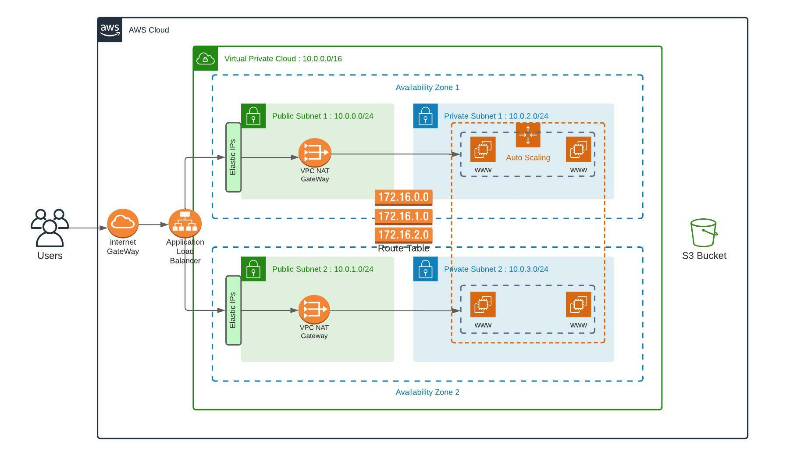

# Deploy a high-availability web app using CloudFormation

## Scenario

Your company is creating an Instagram clone called Udagram.

Developers want to deploy a new application to the AWS infrastructure.

You have been tasked with provisioning the required infrastructure and deploying a dummy application, along with the necessary supporting software.

This needs to be automated so that the infrastructure can be discarded as soon as the testing team finishes their tests and gathers their results.

## Server specs

1. You'll need to create a Launch Configuration for your application servers in order to deploy four servers, two located in each of your private subnets. The launch configuration will be used by an auto-scaling group.

2. You'll need two vCPUs and at least 4GB of RAM. The Operating System to be used is Ubuntu 18. So, choose an Instance size and Machine Image (AMI) that best fits this spec.

3. Be sure to allocate at least 10GB of disk space so that you don't run into issues. 

## Security Groups and Roles


1. Since you will be downloading the application archive from an S3 Bucket, you'll need to create an IAM Role that allows your instances to use the S3 Service.

2. Udagram communicates on the default HTTP Port: 80, so your servers will need this inbound port open since you will use it with the Load Balancer and the Load Balancer Health Check. As for outbound, the servers will need unrestricted internet access to be able to download and update their software.

3. The load balancer should allow all public traffic (0.0.0.0/0) on port 80 inbound, which is the default HTTP port. Outbound, it will only be using port 80 to reach the internal servers.

4. The application needs to be deployed into private subnets with a Load Balancer located in a public subnet.

5. One of the output exports of the CloudFormation script should be the public URL of the LoadBalancer. Bonus points if you add http:// in front of the load balancer DNS Name in the output, for convenience.

## Other Considerations

1. You can deploy your servers with an SSH Key into Public subnets while you are creating the script. This helps with troubleshooting. Once done, move them to your private subnets and remove the SSH Key from your Launch Configuration.

2. It also helps to test directly, without the load balancer. Once you are confident that your server is behaving correctly, increase the instance count and add the load balancer to your script.

3. While your instances are in public subnets, you'll also need the SSH port open (port 22) for your access, in case you need to troubleshoot your instances.

4. Log information for UserData scripts is located in this file: cloud-init-output.log under the folder: /var/log.

5. You should be able to destroy the entire infrastructure and build it back up without any manual steps required, other than running the CloudFormation script.

6. The provided UserData script should help you install all the required dependencies. Bear in mind that this process takes several minutes to complete. Also, the application takes a few seconds to load. This information is crucial for the settings of your load balancer health check.

7. It's up to you to decide which values should be parameters and which you will hard-code in your script.

8. See the provided supporting code for help and more clues.

9. If you want to go the extra mile, set up a bastion host (jump box) to allow you to SSH into your private subnet servers. This bastion host would be on a Public Subnet with port 22 open only to your home IP address, and it would need to have the private key that you use to access the other servers.

## Architecture diagram

<br>



<br>

## Infrastructure Deployment

The application infrastructure consists of deploying the following stacks:
1. Network. This includes VPC, two pairs of public and private subnets, Internet Gateway, NAT Gateways and Routing Tables for public and private subnets with associations.
2. Application services. In particular, Load Balancer, web servers and corresponding autoscaling, target and security groups.

### Create infrastructure

To create the infrastructure stack run the following commands in the same order as below:

```SH
./deploy_helpers/create.sh udm-intra udm-intra.yml udm-intra-params.json
```

```
./deploy_helpers/create.sh udm-servers udm-servers.yml udm-servers-params.json
```

### Update infrastructure

To update the already existing infrastructure stack run one (or all) the following commands:

```
./deploy_helpers/update.sh udm-intra udm-intra.yml udm-intra-params.json
```

```
./deploy_helpers/update.sh udm-servers udm-servers.yml udm-servers-params.json`
```

### Verify deployment

To check whether the web application is running, follow the web application public URL, which could be found in output exports of application-servers cloud formation stack.

<br>


<br>

